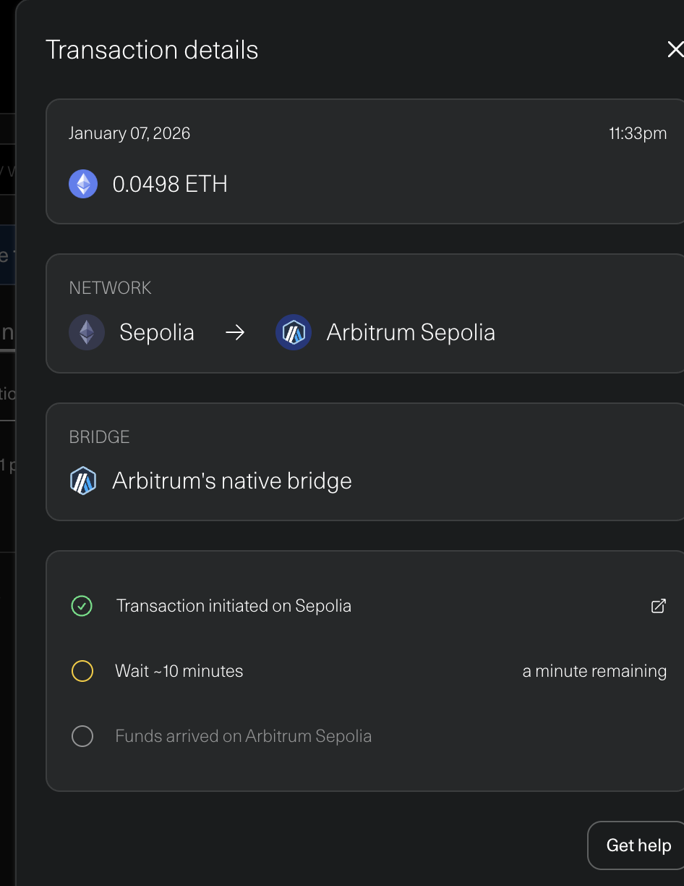
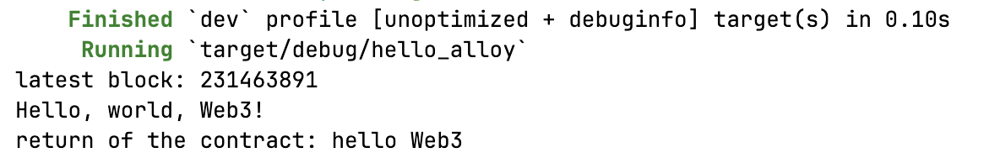

# arbitrum-rust-colearning-Sakkana
> https://moonshotcommons.notion.site/HackQuest-X-Arbitrum-2d6e74465ed580e78be5e703b9f4a408?p=2d6e74465ed5800db592cc2d292cdb94&pm=s

## Task 1

### 操作步骤
0. 水龙头
- 从 https://cloud.google.com/application/web3/faucet/ethereum 领取 0.05 Sepolia ETH
- 从 https://portal.arbitrum.io/bridge 跨链体桥转到 Sepolia Arbitrum



1. 配置 rust 环境，包括：
- cargo
- rustup
- Rust Rover 导入 cargo home 以及 rust lib

2. 编写代码，和链上合约交互
```rust
use alloy::providers::{Provider, ProviderBuilder};
use alloy::primitives::Address;
use std::error::Error;
use alloy::sol;

sol! {
    #[sol(rpc)]
    contract HelloWorldWeb3 {
        function hello_web3() pure public returns (string memory);
    }
}

#[tokio::main]
async fn main() -> Result<(), Box<dyn Error>> {

    let rpc_url = "https://arbitrum-sepolia-rpc.publicnode.com".parse()?;

    let provider = ProviderBuilder::new().connect_http(rpc_url);

    let latest_block = provider.get_block_number().await?;

    println!("latest block: {:?}", latest_block);
    println!("Hello, world, Web3!");

    // 远程部署好的合约
    let contarct_address: Address = "0x3f1f78ED98Cd180794f1346F5bD379D5Ec47DE90".parse()?;

    // 这个合约里的一个函数
    let contract = HelloWorldWeb3::new(contarct_address, provider);

    let result = contract.hello_web3().call().await?;
    println!("return of the contract: {}", result);

    Ok(())
}

```

3. 运行代码
```shell
cargo run
```

4. 结果

   
