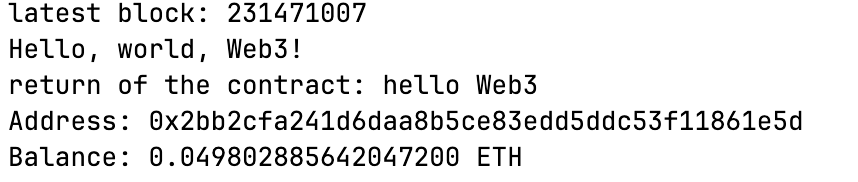
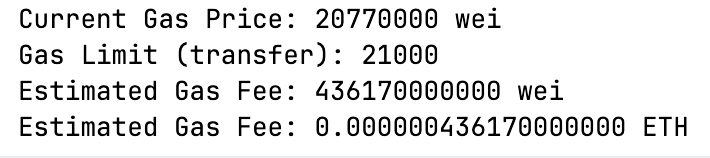

# arbitrum-rust-colearning-Sakkana
> https://moonshotcommons.notion.site/HackQuest-X-Arbitrum-2d6e74465ed580e78be5e703b9f4a408?p=2d6e74465ed5800db592cc2d292cdb94&pm=s

## Task 1

### 操作步骤
0. 水龙头
- 从 https://cloud.google.com/application/web3/faucet/ethereum 领取 0.05 Sepolia ETH
- 从 https://portal.arbitrum.io/bridge 跨链体桥转到 Sepolia Arbitrum


1. 配置 rust 环境，包括：
- cargo
- rustup
- Rust Rover 导入 cargo home 以及 rust lib

2. 编写代码，和链上合约交互
```rust
use alloy::providers::{Provider, ProviderBuilder};
use alloy::primitives::Address;
use std::error::Error;
use alloy::sol;

sol! {
    #[sol(rpc)]
    contract HelloWorldWeb3 {
        function hello_web3() pure public returns (string memory);
    }
}

#[tokio::main]
async fn main() -> Result<(), Box<dyn Error>> {

    let rpc_url = "https://arbitrum-sepolia-rpc.publicnode.com".parse()?;

    let provider = ProviderBuilder::new().connect_http(rpc_url);

    let latest_block = provider.get_block_number().await?;

    println!("latest block: {:?}", latest_block);
    println!("Hello, world, Web3!");

    // 远程部署好的合约
    let contarct_address: Address = "0x3f1f78ED98Cd180794f1346F5bD379D5Ec47DE90".parse()?;

    // 这个合约里的一个函数
    let contract = HelloWorldWeb3::new(contarct_address, provider);

    let result = contract.hello_web3().call().await?;
    println!("return of the contract: {}", result);

    Ok(())
}

```

3. 运行代码
```shell
cargo run
```

4. 结果

   


## Task 2
```shell
export MY_ARB_ADDRESS="0x......"
```

编写代码：
```rust
// task2: 查询自己的余额
async fn task_2() -> Result<(), Box<dyn Error>> {
    // arb sepolia rpc
    let rpc_url = "https://arbitrum-sepolia-rpc.publicnode.com";
    let provider: EthersProvider<Http> = EthersProvider::<Http>::try_from(rpc_url)?;

    // 查询余额
    let address_str = env::var("MY_ARB_ADDRESS")?;
    let address: EthAddress = address_str.parse()?;
    let balance_wei = provider.get_balance(address, None).await?;

    // wei -> ETH
    let balance_eth = format_ether(balance_wei);
    println!("Address: {:?}", address);
    println!("Balance: {} ETH", balance_eth);

    Ok(())
}
```




## task 3
Gas Fee = Gas Price × Gas Limit

	•	Gas Price：通过 ethers-rs 从 RPC 动态获取
	•	Gas Limit：ETH 基础转账行业通用值 → 21000

编写代码：
```rust
// task 3: 计算 arbitrum gas 费用
async fn task_3() -> Result<(), Box<dyn Error>> {
    // Gas Fee = Gas Price × Gas Limit

    // Arbitrum Sepolia RPC
    let rpc_url = "https://arbitrum-sepolia-rpc.publicnode.com";
    let provider = EthersProvider::<Http>::try_from(rpc_url)?;

    // 动态获取当前 Gas Price - 单位：wei
    let gas_price: U256 = provider.get_gas_price().await?;
    println!("Current Gas Price: {} wei", gas_price);

    // 基础 ETH 转账 Gas Limit（行业通用值）
    let gas_limit: U256 = U256::from(21_000u64);

    // 3计算 Gas 费用
    let gas_fee_wei = gas_price * gas_limit;
    let gas_fee_eth = format_ether(gas_fee_wei);

    println!("Gas Limit (transfer): {}", gas_limit);
    println!("Estimated Gas Fee: {} wei", gas_fee_wei);
    println!("Estimated Gas Fee: {} ETH", gas_fee_eth);

    Ok(())
}
```

